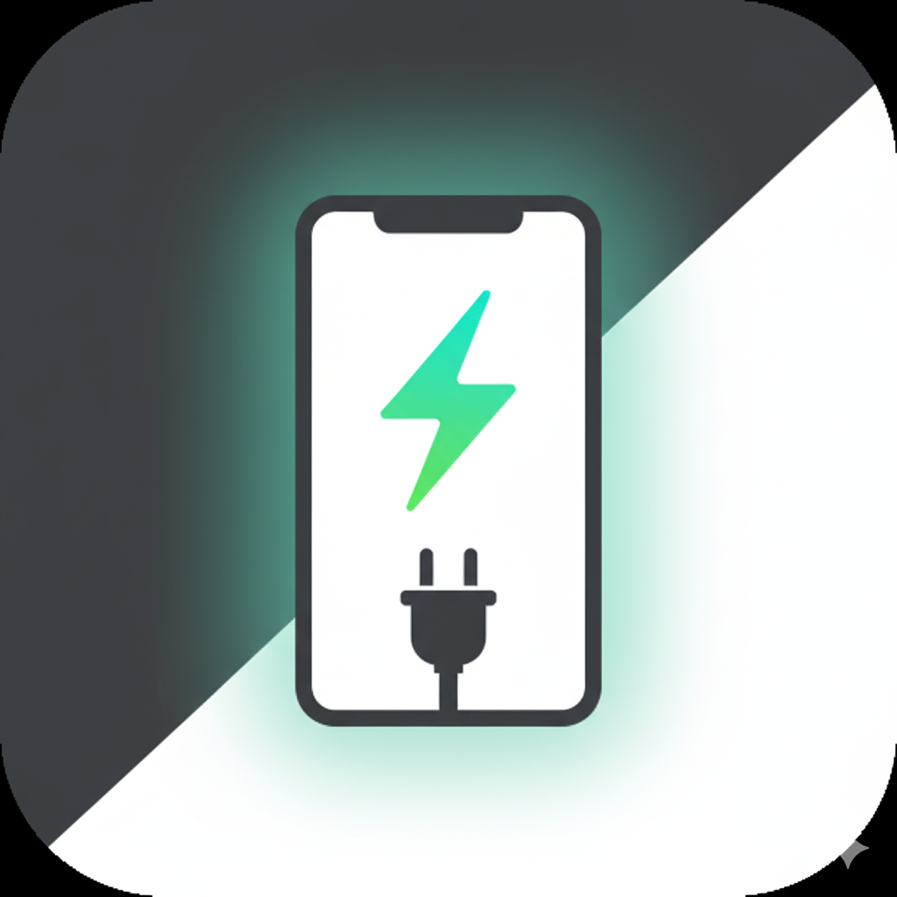
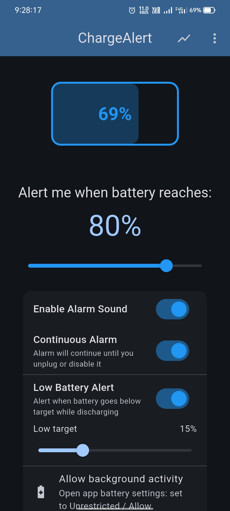
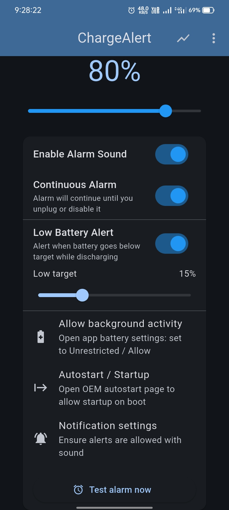
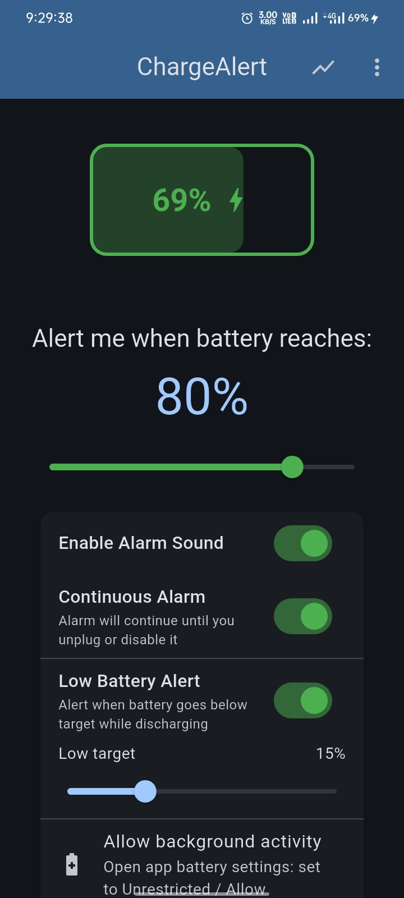
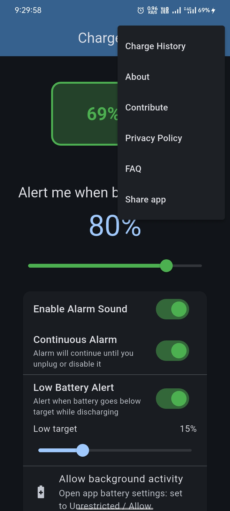
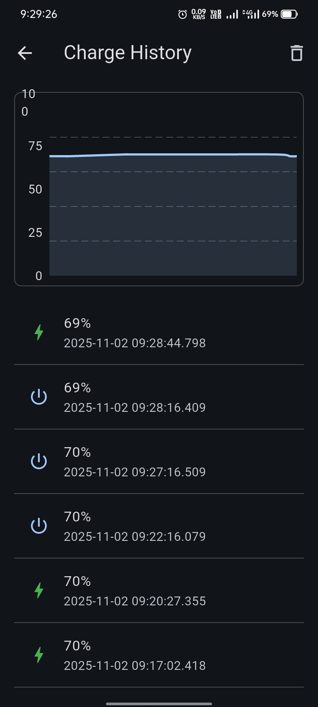

<div align="center">



<h1>ChargeAlert ⚡</h1>

<p>Smart charging alerts, low-battery warnings, and a beautiful interactive charge history.</p>


  
  
  
  

</div>

---

## Table of Contents

- **Overview**
- **Features**
- **Screenshots**
- **Quick Start**
- **Permissions & Setup**
- **Usage**
- **FAQ / Troubleshooting**
- **Roadmap**
- **Contributing**
- **License**

## Overview

ChargeAlert helps you take better care of your battery. Set a charge target (e.g., 80%), get notified reliably, and explore your recent charging patterns with a smooth, interactive chart.

## Features

- **Target alert**: Notify when battery reaches your chosen percentage.
- **Continuous alarm**: Keep alerting until unplugged or disabled.
- **Low-battery alert**: While discharging, warn at a configurable threshold.
- **Interactive charge history**: Smooth curved chart with touch tooltips.
- **OEM shortcuts**: One-tap access to background, autostart, and notification settings.
- **Privacy-first**: History stored locally on your device only.

## Screenshots

> App screenshots

<p align="center">
  
  
  
  
  
</p>

## Quick Start

```bash
flutter pub get
flutter run
```

Requirements:

- Flutter 3.22+
- Android device/emulator (iOS supported with appropriate setup)

## Permissions & Setup

- On Android 13+, the app requests the Notifications permission at runtime.
- A high-importance notification channel is created for alerts.
- For best reliability, enable on your device:
  - Background/unrestricted battery usage for ChargeAlert
  - OEM Autostart/Startup permission
  - Notifications with sound

Use the in-app Settings tiles and the FAQ sheet to jump directly to these pages.

## Usage

- Set the charge target from the Home screen slider.
- Toggle alarm sound, continuous alarm, and low-battery alerts.
- Open the History page from the top-right chart icon or the overflow menu.
- Interact with the chart: press/hold to see exact values and timestamps.
- History samples are captured periodically, deduplicated, and capped to the latest ~500 entries (stored in SharedPreferences).

## FAQ / Troubleshooting

- **Alarm didn’t ring**
  - Allow background/unrestricted battery usage for the app.
  - Enable OEM autostart/startup.
  - Ensure notifications are allowed with sound.
  - Use “Test alarm now” from the Home screen to verify setup.

## Roadmap

- Time range filters for history (24h / 7d / 30d)
- Export history (CSV)
- Optional cloud backup (opt‑in)

## Contributing

Issues and PRs are welcome. If you’re adding a major feature, please open an issue to discuss the approach first.

## License

MIT
