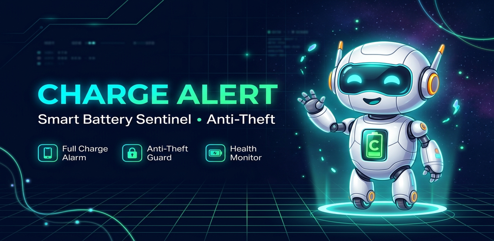
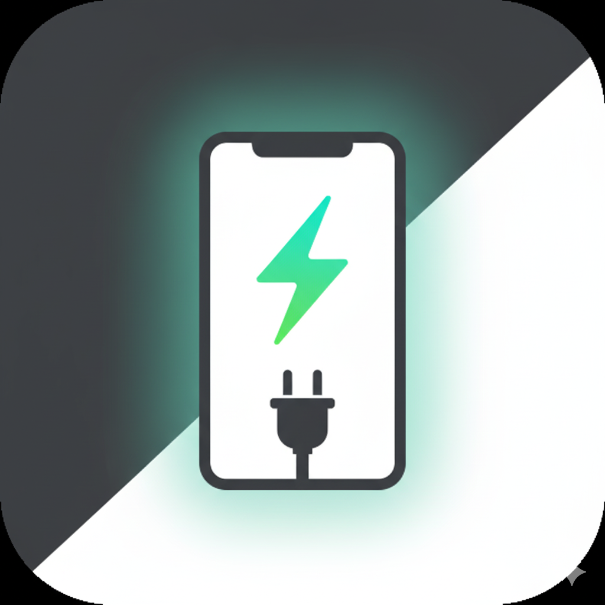
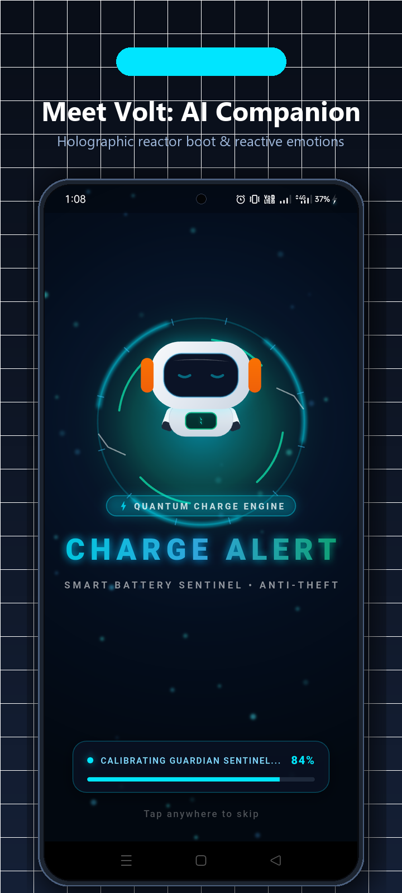
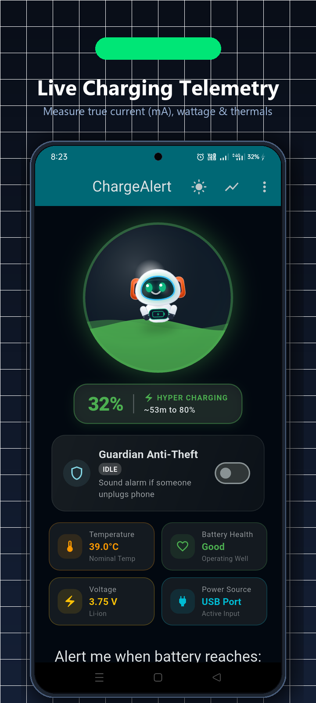
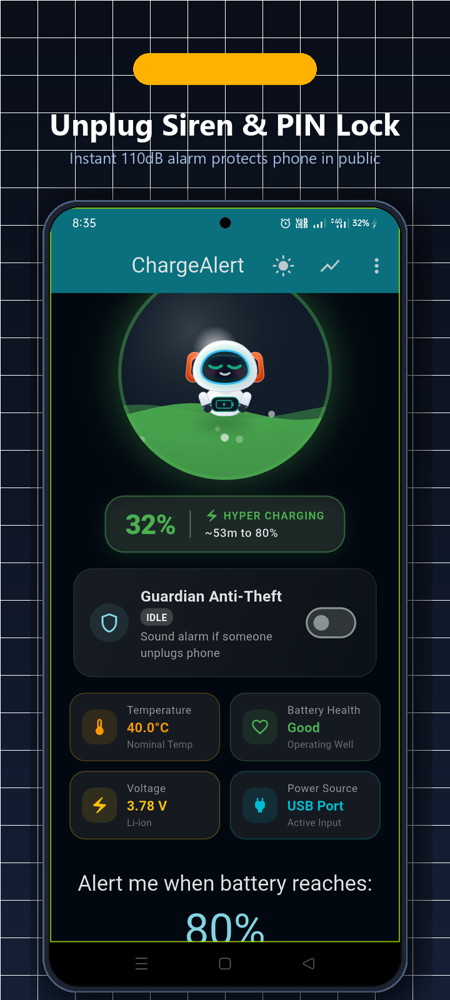
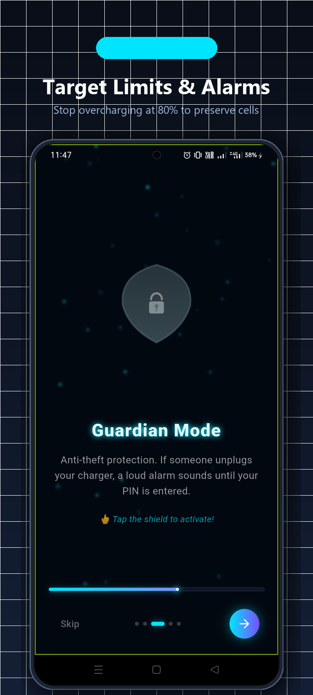
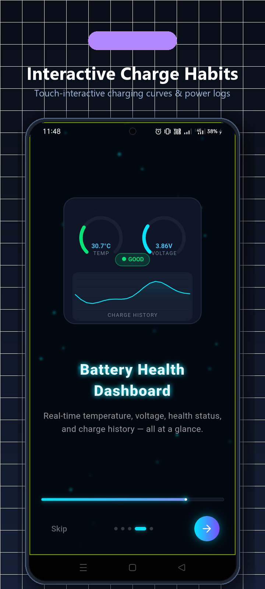
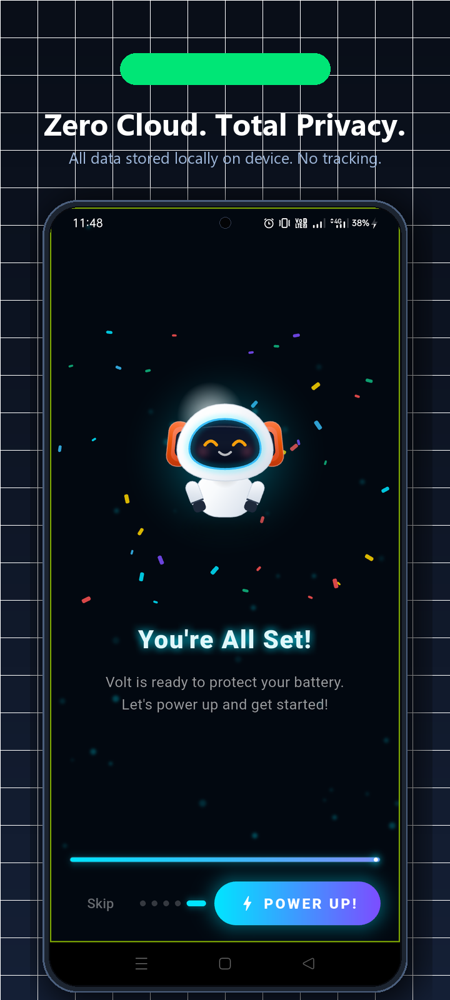

<div align="center">



<br/><br/>



# ChargeAlert ⚡

**Smart charging alerts, 3D Volt companion, anti-theft guardian, and real-time battery telemetry.**

[](https://flutter.dev)
[](https://android.com)
[](https://riverpod.dev)
[](https://pub.dev/packages/fl_chart)
[](https://github.com/Subrata0Ghosh/charge_alert/releases)
[](LICENSE)

</div>

---

## 📖 Table of Contents

- [Overview](#overview)
- [Key Features](#-key-features)
- [App Video](#-app-video)
- [Screenshots](#-screenshots)
- [Quick Start](#-quick-start)
- [Permissions & Setup](#-permissions--setup)
- [Usage Guide](#-usage-guide)
- [FAQ & Troubleshooting](#-faq--troubleshooting)
- [Roadmap](#-roadmap)
- [Contributing](#-contributing)
- [License](#-license)

---

## Overview

**ChargeAlert** is an intelligent, privacy-first battery companion built with Flutter. Protect your battery lifespan by setting custom target charge thresholds (e.g. 80%), protect against opportunistic theft with unplug detection, and explore your charging history through interactive, smooth telemetry charts.

Featuring **Volt**, an interactive 3D companion with reactive behavioral states, eye-tracking, and live charging status feedback!

---

## ✨ Key Features

- 🤖 **Interactive 3D Volt Companion**: Expressive mascot responding dynamically to plug events, battery level changes, touch, and gyro tilt.
- ⚡ **Precision Charge Target Alarm**: Sound high-priority alarms as soon as your device reaches a desired percentage (e.g., 80% to maximize lithium battery health).
- 🚨 **Anti-Theft Sentinel**: Detects sudden charger disconnects when activated and sounds a continuous alarm until disarmed.
- 🔕 **Configurable Low Battery Alert**: Stay informed before your battery completely drains while away from a charger.
- 📈 **Interactive Telemetry & History**: Beautiful curved charts powered by `fl_chart` with interactive tooltips and historical charge session tracking.
- 🛠️ **OEM Optimization Assistant**: One-tap access to battery optimization, background autostart, and notification channel settings.
- 🔒 **100% Privacy-First**: All telemetry and logs remain purely on your device in local storage. No trackers, no data collection.

---

## 🎬 App Video

### Promo & Feature Showcase
Watch ChargeAlert in action:

<div align="center">

<video src="play_store_assets/ChargeAlert_Promo_Video.mp4" controls="controls" width="100%" poster="play_store_assets/feature_graphic_1024x500.png">
  <p>Your browser doesn't support HTML5 video. <a href="play_store_assets/ChargeAlert_Promo_Video.mp4">Click here to watch the Promo Video</a>.</p>
</video>

*Direct link: [▶️ ChargeAlert Promo Video (MP4)](play_store_assets/ChargeAlert_Promo_Video.mp4)*

</div>

#### Additional Demonstrations:
- 🎵 [Media Playback Demo](play_console_videos/ChargeAlert_Media_Playback_Demo.mp4)
- 🛡️ [Special Use / Anti-Theft Demo](play_console_videos/ChargeAlert_Special_Use_Demo.mp4)

---

## 📱 Screenshots

<p align="center">
  
  
  
</p>

<p align="center">
  
  
  
</p>

---

## 🚀 Quick Start

### Prerequisites
- Flutter SDK `3.22.0` or higher
- Android Studio / VS Code with Flutter extension
- Android device or emulator (API 26+)

### Installation & Run

```bash
# Clone the repository
git clone https://github.com/Subrata0Ghosh/charge_alert.git
cd charge_alert

# Install dependencies
flutter pub get

# Run the app in debug mode
flutter run
```

---

## ⚙️ Permissions & Setup

- **Android 13+ Notifications**: The app requests runtime permission to dispatch critical charge and theft alerts.
- **High-Priority Sound Channel**: Used to bypass system DND for essential alarms when configured.
- **Background Execution**: For uninterrupted monitoring on OEM systems (MIUI, ColorOS, OneUI, OxygenOS):
  - Disable aggressive battery optimization for ChargeAlert.
  - Enable OEM Autostart permission.
  - Ensure Notifications are enabled with sound.

Quick shortcut links to device settings are built right into the app's settings page.

---

## 🕹️ Usage Guide

1. **Target Alert**: Adjust the slider on the Home screen to your target battery percentage (e.g. 80%). Toggle the switch to activate.
2. **Guardian / Theft Mode**: Enable Guardian Mode before leaving your phone plugged in public spaces. Disconnecting the cable triggers the alarm immediately.
3. **Telemetry & History**: Tap the chart icon to view historical charge cycles, slope rates, and timestamps.
4. **Interactive Volt**: Tap or tilt your device to see Volt react and keep track of your charging status in real time.

---

## ❓ FAQ & Troubleshooting

- **The alarm didn't ring when target was reached:**
  - Ensure background battery optimization is set to "Unrestricted".
  - Ensure notifications and media volume are turned up.
  - Use the in-app "Test Alarm Now" button to verify device sound playback.

- **How is data stored?**
  - All logs and settings are saved locally using `SharedPreferences`. No analytics or cloud sync libraries are bundled.

---

## 🗺️ Roadmap

- [ ] Time range filtering for telemetry (24h / 7d / 30d views)
- [ ] CSV Export for charging session telemetry
- [ ] Custom alarm sound picker from device storage
- [ ] Home screen widget showing Volt and current charge stats

---

## 🤝 Contributing

Contributions, bug reports, and suggestions are welcome!
1. Fork the Project
2. Create your Feature Branch (`git checkout -b feature/AmazingFeature`)
3. Commit your Changes (`git commit -m 'feat: add some AmazingFeature'`)
4. Push to the Branch (`git push origin feature/AmazingFeature`)
5. Open a Pull Request

---

## 📄 License

Distributed under the MIT License. See `LICENSE` for more information.
